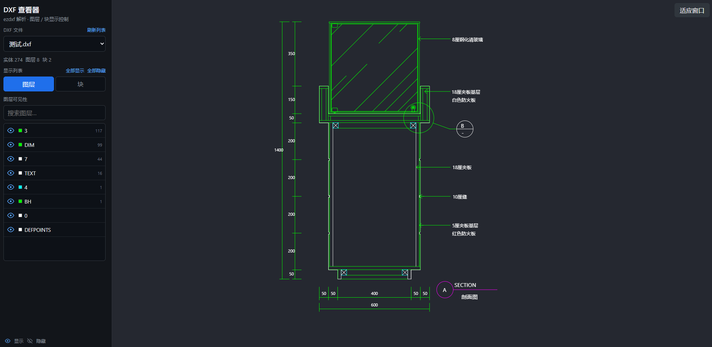

# DXF 图层 / 块查看器

基于 **ezdxf** 解析 AutoCAD DXF 图纸，**FastAPI** 提供几何 JSON 数据，**Vue 3 + Canvas 2D** 在浏览器中渲染，并通过眼睛图标控制图层与块的显示/隐藏。

适用于建筑、机电、弱电等 CAD 图纸的快速预览与图层筛选，**无需安装 AutoCAD**；在 CAD 中导出 DXF 后放入 `dxf/` 目录即可使用。

## 效果展示

启动前后端后，在浏览器中可完成：

- 左侧切换 DXF 文件、按图层/块显示或隐藏、搜索与批量操作
- 右侧 Canvas 预览：滚轮缩放、拖拽平移、「适应窗口」复位
- 支持中文文件名与大体量图纸（解析结果带磁盘缓存，二次打开更快）

 

## 目录

- [DXF 图层 / 块查看器](#dxf-图层--块查看器)
  - [效果展示](#效果展示)
  - [目录](#目录)
  - [功能特性](#功能特性)
  - [技术栈](#技术栈)
  - [项目结构](#项目结构)
  - [环境要求](#环境要求)
  - [快速启动](#快速启动)
  - [使用说明](#使用说明)
  - [从 CAD 导出 DXF](#从-cad-导出-dxf)
  - [添加与管理图纸](#添加与管理图纸)
  - [API](#api)
  - [缓存机制](#缓存机制)
  - [支持的实体类型](#支持的实体类型)
  - [生产构建](#生产构建)
  - [架构说明](#架构说明)
  - [常见问题](#常见问题)

## 功能特性

- **DXF 解析**：后端读取 `dxf/` 目录下的 `.dxf`，导出图层、块定义、模型空间实体与包围盒
- **多级缓存**：内存缓存 + `backend/.cache/dxf/` 磁盘缓存，大文件二次加载显著加速
- **Canvas 渲染**：线段、多段线、圆、弧、填充、文字、块引用（含嵌套块展开）等
- **图层 / 块控制**：左侧列表切换可见性，支持搜索与批量显示/隐藏
- **交互操作**：滚轮缩放（以鼠标为中心）、拖拽平移、「适应窗口」一键复位
- **性能优化**：Web Worker 块展开、视口空间网格索引、`requestAnimationFrame` 合并重绘、GZip 压缩 API 响应

## 技术栈

| 层级 | 技术 |
|------|------|
| 后端 | Python 3 · FastAPI · ezdxf · uvicorn |
| 前端 | Vue 3 · Vite · Canvas 2D · Web Worker |
| 通信 | REST JSON；开发环境 Vite 将 `/api` 代理到 `127.0.0.1:8000` |

## 项目结构

```
test/
├── dxf/                              # DXF 图纸目录（放置或导出到此）
│   ├── Drawing1.dxf
│   ├── Drawing2.dxf
│   ├── 会所强弱电、水位图.dxf
│   └── 餐厅装修施工图.dxf
├── backend/
│   ├── app.py                        # FastAPI 路由、CORS、GZip
│   ├── dxf_parser.py                 # ezdxf 解析 → JSON（PARSER_VERSION）
│   ├── dxf_cache.py                  # 解析结果磁盘缓存
│   ├── requirements.txt
│   └── .cache/dxf/                   # 自动生成，已加入 .gitignore
└── frontend/
    ├── index.html
    ├── vite.config.js                # 开发代理 /api → 后端
    ├── package.json
    └── src/
        ├── App.vue                   # 侧边栏、文件选择、图层/块列表
        ├── api/dxf.js                # 后端 API 封装
        ├── utils/geometry.js         # 块展开、包围盒、空间索引
        ├── workers/
        │   └── dxfPrepare.worker.js  # Worker：块展开与 bbox 预计算
        └── components/
            ├── DxfCanvas.vue         # Canvas 渲染与交互
            └── EyeToggle.vue         # 眼睛图标切换
```

> **说明**：本查看器只读取 **`.dxf`**，不能直接打开 `.dwg`。若手头是 DWG，请在 CAD 中另存为或导出 DXF（见下文）。

## 环境要求

| 依赖 | 版本 |
|------|------|
| Python | 3.10+ |
| Node.js | 18+ |
| 包管理 | Yarn 1.x / 4.x，或 npm |

## 快速启动

需**同时**启动后端与前端。

### 1. 后端

```bash
cd backend
pip install -r requirements.txt
python app.py
```

默认地址：http://127.0.0.1:8000  

健康检查：http://127.0.0.1:8000/api/health → `{"ok":true}`

也可使用：

```bash
cd backend
uvicorn app:app --reload --host 127.0.0.1 --port 8000
```

> 请在 **`backend/`** 目录下执行上述命令，确保能正确导入 `dxf_parser`、`dxf_cache` 等模块。

### 2. 前端

```bash
cd frontend
yarn          # 或 npm install
yarn dev      # 或 npm run dev
```

浏览器打开：http://localhost:5173  

前端通过 Vite 将 `/api` 代理到后端，**必须先启动后端**再访问页面。

> 请通过 **Vite 开发地址（5173）** 访问，不要直接双击打开 `frontend/dist/index.html`，否则 `/api` 无法代理，文件列表与解析请求会失败。

### 3. 验证图纸是否可用

```bash
# 列出 dxf/ 下文件
curl http://127.0.0.1:8000/api/files

# 解析指定文件（将文件名换成你的）
curl "http://127.0.0.1:8000/api/dxf/parse?file=Drawing1.dxf"
```

返回 JSON 且含 `bounds`、`layers`、`entities` 即表示导出与解析正常。首次解析大文件可能需数十秒，之后会命中磁盘缓存。

## 使用说明

| 操作 | 说明 |
|------|------|
| 选择文件 | 左侧下拉框切换 `dxf/` 目录中的 DXF |
| 刷新列表 | 点击「刷新列表」；页面也会每 4 秒自动检测 `dxf/` 目录变化 |
| 图层 / 块 | 切换 Tab，点击眼睛图标显示或隐藏 |
| 搜索 | 在列表上方输入关键字过滤名称 |
| 全部显示 / 全部隐藏 | 批量操作当前 Tab 下的所有项 |
| 滚轮 | 以鼠标位置为中心缩放 |
| 拖拽 | 按住左键平移画布 |
| 适应窗口 | 右上角按钮，将图纸缩放至适合视口 |

**显示逻辑**

- **图层**：隐藏后，该图层上的实体（含块内同图层几何）不再绘制
- **块**：隐藏后，该块的所有 `INSERT` 实例及其展开几何不再绘制
- 图层与块规则**同时生效**（例如块已显示但所在图层被隐藏，仍不绘制）
- 加载 DXF 时，CAD 中**关闭**的图层（`on: false`）会默认在查看器中隐藏

## 从 CAD 导出 DXF

### 导出前须知

| 项目 | 建议 |
|------|------|
| 文件格式 | 使用 **DXF**（`.dxf`），不要用 DWG 直接放入项目 |
| DXF 版本 | **AutoCAD 2007 / 2010 / 2018 DXF** 均可；优先 **2010 或 2007**（兼容性好） |
| 编码 | 优先 **ASCII DXF**；二进制 DXF 一般也能解析，但排查问题较难 |
| 导出空间 | 导出 **模型空间（Model）** 中的内容；仅布局/图纸空间的内容可能看不到 |
| 图层与块 | **保留图层、块定义**，无需全部炸开；本查看器支持 `INSERT` 与图层筛选 |
| 外部参照 | 导出前建议 **绑定（Bind）** 或 **插入（Insert）** 外部参照，避免缺图 |
| 文件大小 | 超大平面图可先在 CAD 中关闭无关图层再导出，或按楼栋/楼层拆分多个 DXF |

### Autodesk AutoCAD

**方法一：另存为（常用）**

1. 打开 DWG 图纸，确认在 **模型** 选项卡（Model）。
2. **文件 → 另存为**（或 `SAVEAS`）。
3. **文件类型** 选择 **AutoCAD DXF (\*.dxf)**。
4. 点击 **工具** 或 **选项**（因版本而异）：
   - 格式选 **ASCII**（若有）；
   - 版本选 **2010 DXF** 或 **2007 DXF**。
5. 保存到本项目的 **`dxf/`** 目录（或先存到桌面再复制进去）。

**方法二：导出（部分版本）**

1. **输出** 选项卡 → **导出** → **其他格式**。
2. 文件类型选 **DXF**，按向导选择模型空间、版本后保存。

**AutoCAD 命令行（可选）**

```text
SAVEAS
; 在对话框中选择 DXF，版本 2010
```

### 中望 CAD（ZWCAD）

1. **文件 → 另存为**。
2. 类型选 **DXF (\*.dxf)**。
3. 在版本下拉框中选择 **2010** 或 **2007**。
4. 若有 **ASCII / 二进制** 选项，选 **ASCII**。
5. 保存至 `dxf/` 目录。

### 浩辰 CAD（GstarCAD）

1. **文件 → 另存为** → 文件类型 **DXF**。
2. 版本建议 **2010 DXF** 或 **2004/2007 DXF**。
3. 确认当前为 **模型空间** 再保存。

### 天正建筑 / 天正机电等（基于 AutoCAD 平台）

1. 在天正或 AutoCAD 中打开项目图，执行天正相关 **图层整理 / 图块清理**（按需）。
2. 使用底层 **AutoCAD 的「另存为 → DXF」** 流程导出（不要只留天正自定义对象而不转换）。
3. 若导出后在本查看器中缺少管线或标注，可在 CAD 中执行 **炸开（Explode）** 或 **对象转换** 后再导出（会增大文件、丢失部分块结构，仅作兜底）。

### BricsCAD / LibreCAD / DraftSight

- **BricsCAD**：与 AutoCAD 类似，**另存为 → DXF 2010**。
- **LibreCAD**：**文件 → 另存为**，格式选 **DXF R27** 或 **R24**。
- **DraftSight**：**文件 → 另存为 → DXF**，版本选 **2010** 或 **2018**。

### 推荐导出检查清单

导出完成后，建议逐项确认：

- [ ] 扩展名为 `.dxf`，且已放入项目 **`dxf/`** 文件夹
- [ ] 用本查看器或 `curl` 能成功解析（见 [快速启动 §3](#3-验证图纸是否可用)）
- [ ] 主要建筑/机电图层、图块在左侧列表中可见
- [ ] 文字、填充、块引用显示正常（异常时见 [常见问题](#常见问题)）
- [ ] 文件名尽量简短；**中文文件名支持**，但跨机器拷贝时注意编码一致

### 导出常见问题（CAD 侧）

| 现象 | 可能原因与处理 |
|------|----------------|
| 查看器空白 | 内容在布局空间；改在 **模型空间** 导出 |
| 缺块、缺图 | 外部参照未绑定；在 CAD 中 **绑定参照** 后重导 |
| 文字乱码或方框 | CAD 中改用 **宋体、仿宋** 或 **TrueType** 字体；避免仅依赖 SHX 特殊字体 |
| 填充不显示 | 图案填充过于复杂；可在 CAD 中简化 HATCH 或转为 SOLID |
| 文件极大、加载慢 | 关闭无关图层、删除未使用块、按区域拆分 DXF |
| 解析报错 | 尝试降低 DXF 版本（如改为 **2007**）或 **另存为 ASCII DXF** 后重试 |

## 添加与管理图纸

1. 将 `.dxf` 放入项目根目录下的 **`dxf/`** 文件夹（目录不存在时，后端首次列出文件时会自动创建）。
2. 刷新浏览器页面，或在左侧点击 **刷新列表**（页面也会定时扫描新文件）。
3. 默认优先加载 `Drawing1.dxf`（若存在）；也可通过 `GET /api/files` 的 `default` 字段获知默认文件。

**命名建议**

- 支持中文与空格，例如 `会所强弱电、水位图.dxf`。
- API 会对文件名做 URL 编码，无需手动处理。
- 请勿将 DXF 放在 `dxf/` 以外的路径；后端仅允许读取 `dxf/` 内文件，防止路径穿越。
- 避免将 CAD 临时锁文件（如 `.dwl`、`.dwl2`）当作图纸使用。

## API

| 接口 | 说明 |
|------|------|
| `GET /api/health` | 健康检查 |
| `GET /api/files` | 列出 `dxf/` 下所有 `.dxf`；返回 `files`、`default`、`dxfDir`、`scannedAt` |
| `GET /api/dxf/parse?file=Drawing1.dxf` | 解析指定 DXF（仅文件名，不含路径） |

**`GET /api/files` 示例**

```json
{
  "files": ["Drawing1.dxf", "Drawing2.dxf", "会所强弱电、水位图.dxf"],
  "default": "Drawing1.dxf",
  "dxfDir": "E:/.../test/dxf",
  "scannedAt": "2026-05-28T02:00:00+00:00"
}
```

**解析结果主要字段**

```json
{
  "bounds": { "min": [x, y], "max": [x, y] },
  "layers": [{ "name": "...", "color": "#RRGGBB", "aci": 7, "on": true }],
  "blocks": ["块名", "..."],
  "blockDefinitions": { "块名": [/* 块内实体 */] },
  "entities": [/* 模型空间实体 */],
  "stats": { "entityCount": 0, "layerCount": 0, "blockCount": 0 }
}
```

## 缓存机制

为加快大图纸重复打开速度，解析结果有两级缓存：

| 层级 | 位置 | 失效条件 |
|------|------|----------|
| 内存 | 后端进程内 | DXF 文件 `mtime` / `size` 变化，或进程重启 |
| 磁盘 | `backend/.cache/dxf/*.json` | 同上，或 `dxf_parser.PARSER_VERSION` 升级 |

- 修改 DXF 源文件后，缓存会自动失效并重新解析。
- 升级解析逻辑后，请删除 `backend/.cache/dxf/` 或等待版本号变更触发失效。
- 缓存目录已写入 `.gitignore`，无需提交到 Git。

前端在 Worker 中完成块展开与包围盒计算；Worker 不可用时自动回退到主线程同步处理。

## 支持的实体类型

| DXF 类型 | 前端渲染 |
|----------|----------|
| LINE | 线段 |
| LWPOLYLINE / POLYLINE | 多段线（含 bulge 弧段折线近似） |
| CIRCLE | 圆 |
| ARC | 弧（折线近似） |
| ELLIPSE | 椭圆（折线近似） |
| SOLID / TRACE / 3DFACE | 实心填充面 |
| INSERT | 块引用（含嵌套块展开） |
| TEXT / MTEXT | 文字（含中文，依赖系统字体） |
| DIMENSION | 尺寸标注（展开为线、箭头块、标注文字，归属原图层如 `PUB_DIM`） |
| LEADER / MLEADER | 引线（展开为线/多段线，归属原图层） |
| HATCH | 边界填充与图案线（如 AR-CONC、ANSI31） |

未列入上表的实体类型（如部分自定义对象、光栅图像）可能**不会显示**；请在 CAD 中转换为基本几何后再导出。

## 生产构建

```bash
# 前端静态资源
cd frontend
yarn build    # 或 npm run build，输出到 frontend/dist

# 后端 API（示例：监听所有网卡）
cd backend
uvicorn app:app --host 0.0.0.0 --port 8000
```

部署时注意：

- 将 **`dxf/`** 与后端一同部署到服务器，或挂载为数据卷。
- 若前端静态资源与 API 不同域，需配置 CORS 或反向代理（开发环境已启用 CORS `*`）。
- 生产环境可将 Nginx 等反向代理：`/api` → 后端，`/` → `frontend/dist`。
- 大图纸首次解析仍可能较慢，建议在部署机预留 `backend/.cache/` 磁盘空间。

**Nginx 反向代理示例（片段）**

```nginx
location /api/ {
    proxy_pass http://127.0.0.1:8000/api/;
}

location / {
    root /path/to/frontend/dist;
    try_files $uri $uri/ /index.html;
}
```

## 架构说明

```
dxf/*.dxf
   │
   ▼
dxf_parser.py ──→ JSON（图层 / 块 / 实体 / 包围盒）
   │                    ▲
   │              dxf_cache.py（磁盘）
   │                    ▲
   │              app.py 内存缓存
   ▼
FastAPI  /api/dxf/parse  （GZip）
   │
   ▼
Vue  App.vue ──→  DxfCanvas.vue
                  ├── dxfPrepare.worker.js   块展开 + bbox（toRaw 后 postMessage）
                  ├── expandInserts()        Worker 失败时主线程回退
                  ├── SpatialGrid            视口空间索引
                  └── Canvas 2D              绘制可见实体
```

**渲染性能策略**

1. 块展开与包围盒在数据加载时一次性计算（Worker 或主线程）
2. 缩放/平移通过 Canvas `setTransform` 统一变换，避免逐点坐标换算
3. `requestAnimationFrame` 合并同一帧内的多次滚轮/拖拽事件
4. 视口裁剪：仅绘制当前可见区域内的实体，放大局部时减少绘制量

## 常见问题

**页面显示「无法获取文件列表」或加载失败**

- 确认后端已启动：`http://127.0.0.1:8000/api/health` 返回 `{"ok":true}`
- 确认 DXF 位于 **`dxf/`** 目录，而非项目根目录或其他路径
- 确认前端 dev 服务已启动，且浏览器访问的是 **Vite 地址（5173）**，以便 `/api` 代理生效
- 终端若出现 `ECONNREFUSED 127.0.0.1:8000`，说明后端未运行或已崩溃，请先启动 `python app.py`

**后端启动报错 `No module named 'dxf_cache'`**

- 在 **`backend/`** 目录执行 `python app.py`，不要从项目根目录直接运行
- 确认存在 `backend/dxf_cache.py`

**侧边栏有数据，但画布一片空白**

- 打开浏览器开发者工具（F12）→ Console，查看是否有红色报错
- 确认未直接打开 `dist/index.html`，应通过 `yarn dev` 或配置好反向代理后访问
- 点击右上角 **适应窗口**；尝试滚轮缩放或拖拽，排除视图在图纸范围外
- 检查是否误将图层/块全部隐藏

**下拉框没有新放入的文件**

- 刷新页面或点击「刷新列表」；后端会扫描 `dxf/*.dxf`
- 确认扩展名为小写 `.dxf`

**解析返回 404**

- 检查 `file` 参数是否仅为文件名（如 `Drawing1.dxf`），不要带 `dxf/` 前缀
- 确认文件确实存在于 `dxf/` 目录

**解析返回 500**

- 查看响应 `detail` 字段；常见原因为 DXF 损坏、版本过新或含不支持对象
- 在 CAD 中另存为 **DXF 2007/2010 ASCII** 后重试

**文字显示异常**

- 依赖系统已安装中文字体（如 Microsoft YaHei、PingFang SC、SimSun）
- CAD 导出时尽量使用 TrueType 或常见 SHX 字体

**图纸很大时仍然较慢**

- 首次解析会写入磁盘缓存，第二次打开同一文件会快很多
- 在查看器中隐藏不需要的图层/块
- 在 CAD 导出前精简图层与块
- 当前为**全量 JSON 加载**，超大图纸可考虑后续做分块或后端预处理

**修改 DXF 后查看器仍显示旧内容**

- 保存 DXF 后刷新页面；磁盘缓存会按文件修改时间自动失效
- 若仍异常，可手动删除 `backend/.cache/dxf/` 后重试

**从 CAD 导出后与本机 AutoCAD 显示不一致**

- 本查看器为 **2D 预览**，不执行 AutoCAD 全部渲染规则
- 复杂线型、渐变、部分代理对象可能简化或忽略
- 以「图层/块是否可辨、主要几何是否完整」为验收标准即可
